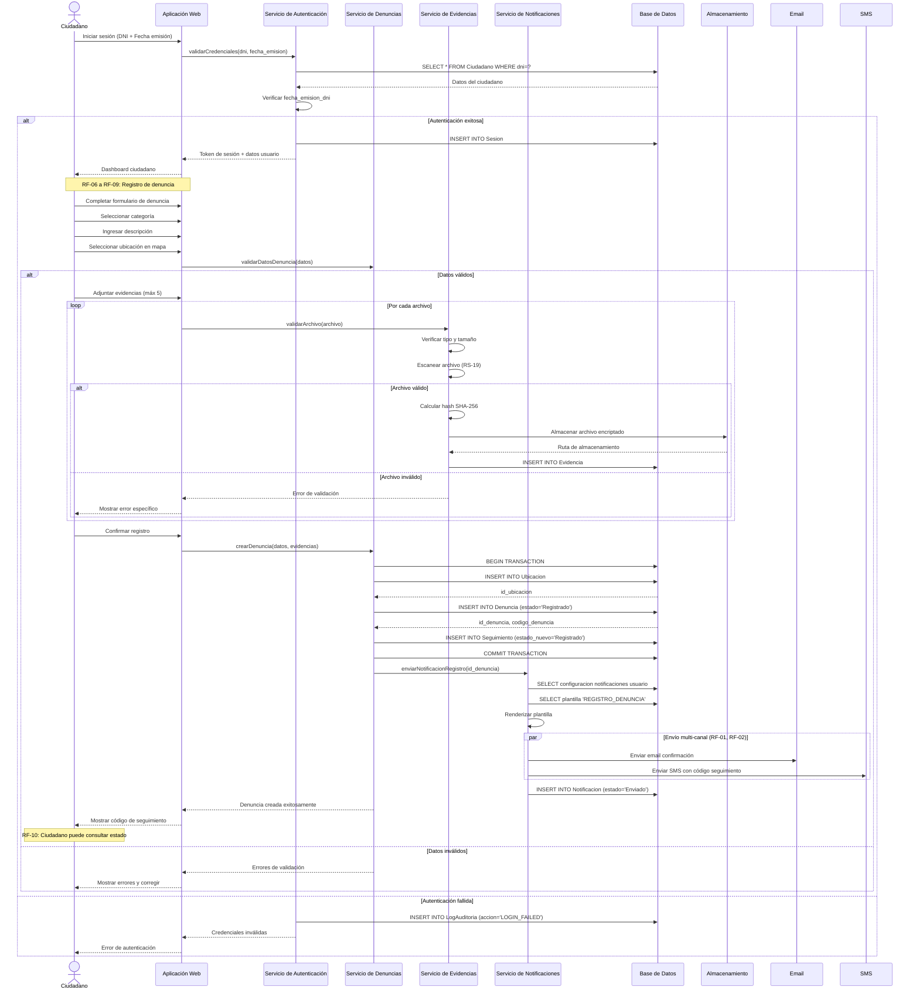
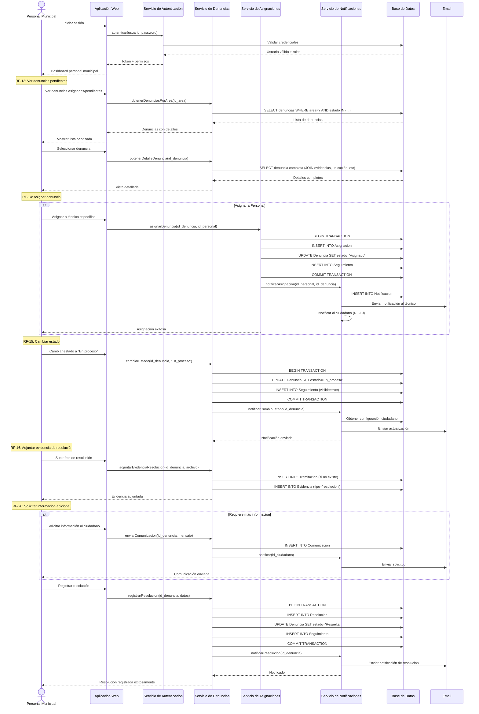
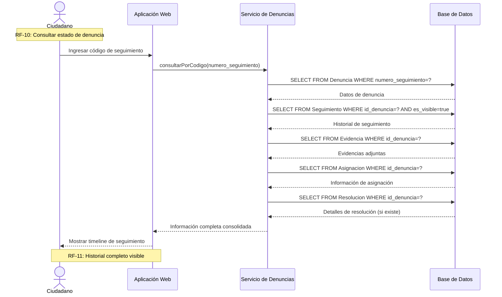
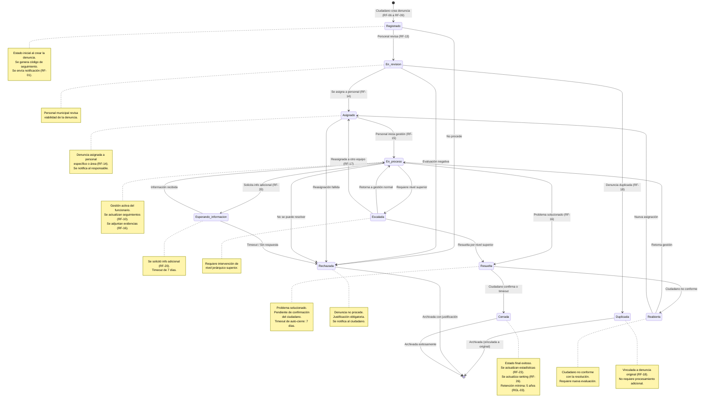
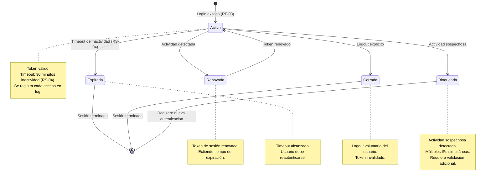
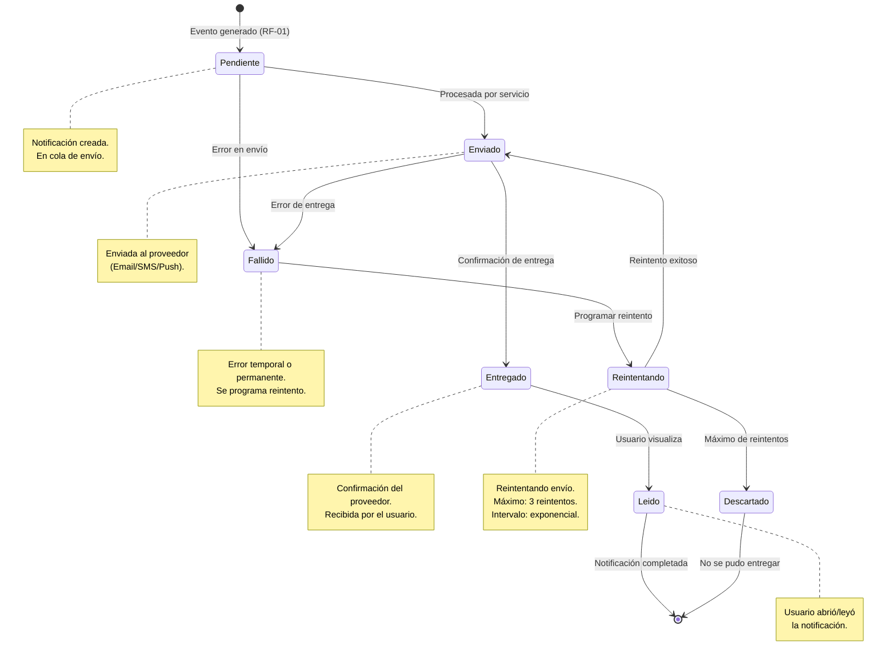

# Diagramas UML

## Diagrama de Clases

```mermaid
classDiagram
    %% Jerarquía de Usuarios (Herencia)
    class Usuario {
        +UUID id_usuario
        +String codigo_usuario
        +String username
        +String password_hash
        +String email
        +DateTime fecha_creacion
        +DateTime fecha_ultima_actualizacion
        +String estado_usuario
        +Boolean requiere_cambio_password
        +DateTime ultimo_acceso
        +String ip_ultimo_acceso
        +iniciarSesion()
        +cerrarSesion()
        +actualizarPerfil()
        +cambiarPassword()
        +habilitarMFA()
    }

    class Ciudadano {
        +UUID id_ciudadano
        +String codigo_ciudadano
        +String dni
        +String nombre
        +String apellido
        +String email
        +String direccion
        +Date fecha_emision_dni
        +DateTime fecha_registro
        +Boolean es_anonimo
        +String estado_cuenta
        +registrarDenuncia()
        +consultarDenuncias()
        +seguirDenuncia()
        +agregarTelefono()
    }

    class PersonalMunicipal {
        +UUID id_personal
        +String codigo_personal
        +String dni
        +String nombre
        +String apellido
        +String email
        +String cargo
        +Date fecha_ingreso
        +String estado_laboral
        +String especialidad
        +asignarDenuncia()
        +procesarDenuncia()
        +cambiarEstadoDenuncia()
        +reasignarDenuncia()
        +comunicarseConCiudadano()
    }

    class Administrador {
        +UUID id_administrador
        +String codigo_administrador
        +String nivel_acceso
        +Boolean es_super_admin
        +gestionarUsuarios()
        +gestionarRoles()
        +gestionarPermisos()
        +configurarSistema()
        +gestionarCategorias()
        +verEstadisticas()
    }

    class Auditor {
        +UUID id_auditor
        +String codigo_auditor
        +String area_supervision
        +Boolean solo_lectura
        +revisarLogs()
        +generarReporteAuditoria()
        +consultarHistorial()
        +analizarTrazabilidad()
    }

    %% Entidad Principal: Denuncia
    class Denuncia {
        +UUID id_denuncia
        +String codigo_denuncia
        +String titulo
        +String descripcion
        +DateTime fecha_registro
        +DateTime fecha_actualizacion
        +EstadoDenuncia estado
        +Prioridad prioridad
        +Boolean es_anonima
        +String numero_seguimiento
        +Boolean requiere_validacion
        +crear()
        +actualizar()
        +cambiarEstado()
        +asignar()
        +adjuntarEvidencia()
        +agregarSeguimiento()
    }

    %% Categorización
    class Categoria {
        +UUID id_categoria
        +String codigo_categoria
        +String nombre
        +String descripcion
        +String color
        +String icono
        +Boolean esta_activo
        +Integer tiempo_respuesta_promedio
        +crear()
        +actualizar()
        +desactivar()
        +asignarArea()
    }

    %% Geolocalización
    class Ubicacion {
        +UUID id_ubicacion
        +String codigo_ubicacion
        +Decimal latitud
        +Decimal longitud
        +String direccion
        +String referencia
        +String distrito
        +String codigo_postal
        +validarCoordenadas()
        +obtenerDistrito()
        +calcularDistancia()
    }

    %% Evidencias
    class Evidencia {
        +UUID id_evidencia
        +String codigo_evidencia
        +String nombre_archivo
        +String ruta_almacenamiento
        +String tipo_archivo
        +Integer tamaño_bytes
        +DateTime fecha_carga
        +String hash_archivo
        +Boolean esta_escaneado
        +subir()
        +descargar()
        +validar()
        +escanearArchivo()
    }

    %% Seguimiento y Trazabilidad
    class Seguimiento {
        +UUID id_seguimiento
        +String codigo_seguimiento
        +EstadoDenuncia estado_anterior
        +EstadoDenuncia estado_nuevo
        +DateTime fecha_hora
        +String comentario
        +Boolean es_visible
        +registrar()
        +consultar()
    }

    %% Estructura Organizacional
    class AreaResponsable {
        +UUID id_area_responsable
        +String codigo_area
        +String nombre
        +String descripcion
        +String email_contacto
        +String telefono_contacto
        +String ubicacion_fisica
        +Boolean esta_activo
        +Integer capacidad_maxima
        +asignarPersonal()
        +asignarCategoria()
        +consultarCarga()
    }

    %% Gestión de Asignaciones
    class Asignacion {
        +UUID id_asignacion
        +String codigo_asignacion
        +DateTime fecha_asignacion
        +DateTime fecha_inicio
        +DateTime fecha_estimada_resolucion
        +String estado_asignacion
        +String observaciones
        +Integer prioridad_interna
        +asignar()
        +reasignar()
        +actualizar()
        +completar()
    }

    %% Tramitación
    class Tramitacion {
        +UUID id_tramitacion
        +String codigo_tramitacion
        +DateTime fecha_inicio
        +DateTime fecha_finalizacion
        +String descripcion_accion
        +String observaciones
        +String estado_tramitacion
        +iniciar()
        +registrarAvance()
        +finalizar()
        +adjuntarEvidencia()
    }

    %% Resolución
    class Resolucion {
        +UUID id_resolucion
        +String codigo_resolucion
        +DateTime fecha_resolucion
        +TipoResolucion tipo_resolucion
        +String descripcion_solucion
        +String acciones_realizadas
        +Decimal costo_estimado
        +Boolean requiere_verificacion
        +String estado_verificacion
        +registrar()
        +validar()
        +notificarCiudadano()
    }

    %% Comunicación
    class Comunicacion {
        +UUID id_comunicacion
        +String codigo_comunicacion
        +String mensaje
        +DateTime fecha_envio
        +Boolean fue_leido
        +DateTime fecha_lectura
        +String tipo_comunicacion
        +Boolean es_interna
        +enviar()
        +marcarLeido()
        +responder()
    }

    %% Sistema de Notificaciones
    class Notificacion {
        +UUID id_notificacion
        +String codigo_notificacion
        +String titulo
        +String mensaje
        +DateTime fecha_envio
        +CanalNotificacion canal
        +EstadoNotificacion estado
        +Boolean fue_leido
        +DateTime fecha_lectura
        +String tipo_evento
        +enviar()
        +marcarLeido()
        +reenviar()
    }

    class PlantillaNotificacion {
        +UUID id_plantilla
        +String codigo_plantilla
        +String nombre
        +String asunto
        +String cuerpo_mensaje
        +String tipo_evento
        +String variables_disponibles
        +Boolean esta_activo
        +crear()
        +actualizar()
        +renderizar()
    }

    class ConfiguracionNotificacion {
        +UUID id_configuracion
        +Boolean notif_email_activo
        +Boolean notif_sms_activo
        +Boolean notif_push_activo
        +Boolean notif_interno_activo
        +String preferencia_horario
        +actualizar()
        +obtenerCanalesActivos()
    }

    %% Control de Acceso
    class Rol {
        +UUID id_rol
        +String codigo_rol
        +String nombre
        +String descripcion
        +Integer nivel_jerarquia
        +Boolean esta_activo
        +crear()
        +actualizar()
        +asignarPermisos()
        +eliminar()
    }

    class Permiso {
        +UUID id_permiso
        +String codigo_permiso
        +String nombre
        +String descripcion
        +String modulo
        +String accion
        +String recurso
        +validar()
    }

    class UsuarioRol {
        +UUID id_usuario
        +UUID id_rol
        +DateTime fecha_asignacion
        +DateTime fecha_expiracion
        +Boolean esta_activo
        +asignar()
        +revocar()
    }

    class RolPermiso {
        +UUID id_rol
        +UUID id_permiso
        +DateTime fecha_asignacion
        +Boolean esta_activo
        +asignar()
        +revocar()
    }

    %% Auditoría y Seguridad
    class LogAuditoria {
        +UUID id_log
        +String codigo_log
        +TipoAccion accion
        +String modulo
        +String tabla_afectada
        +String registro_id
        +String datos_anteriores
        +String datos_nuevos
        +DateTime fecha_hora
        +String ip_origen
        +String user_agent
        +registrar()
        +consultar()
        +exportar()
    }

    class Sesion {
        +UUID id_sesion
        +String token_sesion
        +DateTime fecha_inicio
        +DateTime fecha_expiracion
        +DateTime fecha_ultimo_acceso
        +String ip_origen
        +String user_agent
        +Boolean esta_activo
        +String tipo_autenticacion
        +crear()
        +renovar()
        +cerrar()
        +validar()
    }

    %% Reportes y Estadísticas
    class Reporte {
        +UUID id_reporte
        +String codigo_reporte
        +String titulo
        +String descripcion
        +String tipo_reporte
        +String parametros_json
        +String formato_salida
        +DateTime fecha_generacion
        +String ruta_archivo
        +Boolean es_programado
        +generar()
        +exportar()
        +programar()
        +descargar()
    }

    class Estadistica {
        +UUID id_estadistica
        +String codigo_estadistica
        +String nombre
        +String descripcion
        +String categoria
        +Decimal valor
        +String unidad_medida
        +String periodo
        +DateTime fecha_calculo
        +calcular()
        +actualizar()
        +comparar()
    }

    class Indicador {
        +UUID id_indicador
        +String codigo_indicador
        +String nombre
        +String descripcion
        +String formula_calculo
        +Decimal valor_objetivo
        +Decimal valor_actual
        +String frecuencia_actualizacion
        +String tipo_visualizacion
        +calcular()
        +actualizar()
        +evaluar()
    }

    class Dashboard {
        +UUID id_dashboard
        +String codigo_dashboard
        +String nombre
        +String descripcion
        +String tipo_dashboard
        +String frecuencia_actualizacion
        +Boolean es_publico
        +Integer orden_visualizacion
        +crear()
        +actualizar()
        +agregar Indicador()
        +publicar()
    }

    class TendenciaGeografica {
        +UUID id_tendencia
        +String codigo_tendencia
        +String zona
        +String distrito
        +Integer cantidad_denuncias
        +String categoria_mas_frecuente
        +Decimal tasa_resolucion
        +Decimal tiempo_promedio_atencion
        +String periodo_analisis
        +String nivel_criticidad
        +calcular()
        +analizar()
        +generarMapa()
    }

    class RankingDesempeno {
        +UUID id_ranking
        +String codigo_ranking
        +String periodo_evaluacion
        +Integer posicion
        +Decimal puntaje_total
        +Integer denuncias_atendidas
        +Decimal tasa_resolucion_area
        +Decimal tiempo_promedio_area
        +Decimal calificacion_promedio
        +calcular()
        +comparar()
        +generarReporte()
    }

    %% Relaciones de Herencia
    Usuario <|-- Ciudadano
    Usuario <|-- PersonalMunicipal
    Usuario <|-- Administrador
    Usuario <|-- Auditor

    %% Relaciones Ciudadano-Denuncia
    Ciudadano "0..1" -- "0..*" Denuncia : registra
    Ciudadano "1" -- "0..*" CiudadanoTelefono : tiene

    %% Relaciones de Denuncia
    Denuncia "1" -- "1" Categoria : pertenece
    Denuncia "1" -- "1" Ubicacion : ubicada_en
    Denuncia "1" -- "0..5" Evidencia : contiene
    Denuncia "1" -- "0..*" Seguimiento : tiene
    Denuncia "1" -- "1..*" Asignacion : asignada_a
    Denuncia "1" -- "0..*" Comunicacion : genera
    Denuncia "1" -- "0..*" Notificacion : genera

    %% Relaciones Organizacionales
    Categoria "1" -- "1" AreaResponsable : atendida_por
    AreaResponsable "1" -- "0..*" PersonalMunicipal : tiene
    PersonalMunicipal "1" -- "0..*" Asignacion : crea
    PersonalMunicipal "1" -- "0..*" Asignacion : recibe
    PersonalMunicipal "1" -- "0..*" Comunicacion : envia

    %% Relaciones de Tramitación
    Asignacion "1" -- "0..1" Tramitacion : gestiona
    Tramitacion "1" -- "0..*" Evidencia : adjunta
    Tramitacion "1" -- "0..1" Resolucion : genera

    %% Relaciones de Notificación
    Usuario "1" -- "0..*" Notificacion : recibe
    Usuario "1" -- "0..1" ConfiguracionNotificacion : configura
    PlantillaNotificacion "1" -- "0..*" Notificacion : genera

    %% Relaciones de Control de Acceso (N:M)
    Usuario "0..*" -- "0..*" Rol : tiene >
    Rol "0..*" -- "0..*" Permiso : tiene >
    UsuarioRol .. Usuario
    UsuarioRol .. Rol
    RolPermiso .. Rol
    RolPermiso .. Permiso

    %% Relaciones de Auditoría
    Usuario "1" -- "0..*" Sesion : tiene
    Usuario "1" -- "0..*" LogAuditoria : genera
    PersonalMunicipal "1" -- "0..*" Seguimiento : registra

    %% Relaciones de Reportes
    Administrador "1" -- "0..*" Reporte : genera
    Dashboard "1" -- "0..*" Indicador : contiene
    AreaResponsable "1" -- "0..*" RankingDesempeno : evaluada_en
    Ubicacion "0..*" -- "1" TendenciaGeografica : analizada_en

    class CiudadanoTelefono {
        +UUID id_ciudadano_telefono
        +String telefono
        +Boolean es_principal
    }

    %% Enumeraciones
    class EstadoDenuncia {
        <<enumeration>>
        Registrado
        En_revision
        Asignado
        En_proceso
        Resuelta
        Rechazada
        Cerrada
    }

    class Prioridad {
        <<enumeration>>
        Baja
        Media
        Alta
        Urgente
    }

    class TipoResolucion {
        <<enumeration>>
        Resuelta
        Rechazada
        Duplicada
        No_procede
    }

    class CanalNotificacion {
        <<enumeration>>
        Email
        SMS
        Push
        Interno
    }

    class EstadoNotificacion {
        <<enumeration>>
        Pendiente
        Enviado
        Entregado
        Fallido
        Leido
    }

    class TipoAccion {
        <<enumeration>>
        CREAR
        ACTUALIZAR
        ELIMINAR
        LEER
        LOGIN
        LOGOUT
    }
```

---

## Diagrama de Secuencia

### Secuencia 1: Registro de Denuncia por Ciudadano

---

### Secuencia 2: Asignación y Procesamiento de Denuncia

---

### Secuencia 3: Consulta de Estado por Ciudadano

---

## Diagrama de Actividades

### Actividad: Flujo Completo de Gestión de Denuncias

```mermaid
flowchart TD
    Start([Inicio: Ciudadano accede al sistema]) --> LoginCheck{¿Usuario autenticado?}
    
    LoginCheck -->|No| Login[Iniciar sesión con DNI]
    Login --> ValidarCredenciales{¿Credenciales válidas?}
    ValidarCredenciales -->|No| MostrarErrorLogin[Mostrar error de autenticación]
    MostrarErrorLogin --> RegistrarIntento[Registrar intento fallido RS-03]
    RegistrarIntento --> BloqueoCheck{¿Intentos > 5?}
    BloqueoCheck -->|Sí| BloquearCuenta[Bloquear cuenta temporalmente]
    BloqueoCheck -->|No| Login
    BloquearCuenta --> End1([Fin: Cuenta bloqueada])
    
    ValidarCredenciales -->|Sí| MFACheck{¿Requiere MFA?}
    MFACheck -->|Sí| ValidarMFA[Validar código 2FA]
    ValidarMFA --> MFAValido{¿Código válido?}
    MFAValido -->|No| MostrarErrorLogin
    MFAValido -->|Sí| CrearSesion
    MFACheck -->|No| CrearSesion[Crear sesión RS-04]
    
    LoginCheck -->|Sí| DashboardCiudadano
    CrearSesion --> DashboardCiudadano[Mostrar dashboard ciudadano]
    
    DashboardCiudadano --> AccionCiudadano{Acción del ciudadano}
    
    AccionCiudadano -->|Nueva denuncia| FormularioDenuncia[Mostrar formulario RF-06]
    AccionCiudadano -->|Consultar denuncias| ConsultarDenuncias[Listar denuncias propias RF-10]
    AccionCiudadano -->|Ver estadísticas| MostrarEstadisticas[Mostrar estadísticas públicas RF-12]
    
    FormularioDenuncia --> SeleccionarCategoria[Seleccionar categoría RF-06]
    SeleccionarCategoria --> IngresarDescripcion[Ingresar descripción RF-07]
    IngresarDescripcion --> ValidarDatos{¿Datos completos y válidos?}
    
    ValidarDatos -->|No| MostrarErrores[Mostrar errores de validación]
    MostrarErrores --> FormularioDenuncia
    
    ValidarDatos -->|Sí| SeleccionarUbicacion[Seleccionar ubicación en mapa RF-09]
    SeleccionarUbicacion --> AdjuntarArchivos{¿Adjuntar evidencias?}
    
    AdjuntarArchivos -->|Sí| SubirEvidencias[Subir archivos RF-08]
    SubirEvidencias --> ValidarEvidencias{¿Archivos válidos max 5?}
    ValidarEvidencias -->|No| ErrorEvidencias[Mostrar error de archivos]
    ErrorEvidencias --> SubirEvidencias
    ValidarEvidencias -->|Sí| EscanearArchivos[Escanear con antivirus RS-19]
    EscanearArchivos --> ArchivoSeguro{¿Archivo seguro?}
    ArchivoSeguro -->|No| ErrorVirus[Rechazar archivo infectado]
    ErrorVirus --> SubirEvidencias
    ArchivoSeguro -->|Sí| EncriptarArchivo[Encriptar y almacenar RS-07]
    
    AdjuntarArchivos -->|No| ConfirmarRegistro
    EncriptarArchivo --> ConfirmarRegistro[Confirmar registro]
    
    ConfirmarRegistro --> RequiereValidacion{¿Requiere validación RF-05?}
    RequiereValidacion -->|Sí| EnviarCodigoValidacion[Enviar código 2FA]
    EnviarCodigoValidacion --> ValidarCodigo{¿Código válido?}
    ValidarCodigo -->|No| ConfirmarRegistro
    ValidarCodigo -->|Sí| GuardarDenuncia
    RequiereValidacion -->|No| GuardarDenuncia
    
    GuardarDenuncia[Guardar denuncia en BD]
    GuardarDenuncia --> GenerarCodigos[Generar código denuncia y seguimiento]
    GenerarCodigos --> EstadoInicial[Asignar estado: Registrado]
    EstadoInicial --> RegistrarSeguimiento[Crear registro de seguimiento]
    RegistrarSeguimiento --> RegistrarLog[Registrar en log de auditoría RS-27]
    
    RegistrarLog --> EnviarNotificacionCiudadano[Enviar notificación al ciudadano RF-01]
    EnviarNotificacionCiudadano --> MostrarCodigoSeguimiento[Mostrar código de seguimiento]
    
    MostrarCodigoSeguimiento --> AsignacionAutomatica{¿Área definida por categoría?}
    AsignacionAutomatica -->|Sí| AsignarArea[Asignar a área responsable]
    AsignacionAutomatica -->|No| ColaAsignacion[Agregar a cola de revisión]
    
    AsignarArea --> NotificarPersonal[Notificar a personal municipal RF-13]
    ColaAsignacion --> NotificarPersonal
    
    NotificarPersonal --> PersonalRevisa[Personal municipal revisa denuncia]
    
    PersonalRevisa --> EvaluarProcedencia{¿Denuncia procede?}
    
    EvaluarProcedencia -->|No| VerificarDuplicado{¿Es duplicada RF-18?}
    VerificarDuplicado -->|Sí| MarcarDuplicada[Marcar como duplicada]
    MarcarDuplicado --> RechazarDenuncia
    VerificarDuplicado -->|No| RechazarDenuncia[Cambiar estado: Rechazada]
    RechazarDenuncia --> JustificarRechazo[Agregar justificación]
    JustificarRechazo --> NotificarRechazo[Notificar rechazo al ciudadano RF-19]
    NotificarRechazo --> RegistrarSeguimientoFinal[Registrar en seguimiento]
    RegistrarSeguimientoFinal --> CerrarFlujo
    
    EvaluarProcedencia -->|Sí| AsignarPersonal[Asignar a personal específico RF-14]
    AsignarPersonal --> CambiarEstadoAsignado[Cambiar estado: Asignado]
    CambiarEstadoAsignado --> NotificarAsignacion[Notificar asignación]
    
    NotificarAsignacion --> PersonalInicia[Personal inicia gestión]
    PersonalInicia --> CambiarEstadoProceso[Cambiar estado: En proceso RF-15]
    CambiarEstadoProceso --> NotificarProgreso[Notificar progreso al ciudadano]
    
    NotificarProgreso --> RequiereInfo{¿Requiere info adicional?}
    RequiereInfo -->|Sí| SolicitarInfo[Solicitar información RF-20]
    SolicitarInfo --> EsperarRespuesta[Esperar respuesta ciudadano]
    EsperarRespuesta --> InfoRecibida{¿Info recibida?}
    InfoRecibida -->|No| Timeout{¿Timeout?}
    Timeout -->|Sí| RechazarPorTimeout[Rechazar por falta de info]
    RechazarPorTimeout --> NotificarRechazo
    Timeout -->|No| EsperarRespuesta
    InfoRecibida -->|Sí| RealizarGestion
    RequiereInfo -->|No| RealizarGestion[Realizar gestión correctiva]
    
    RealizarGestion --> AdjuntarEvidenciaResolucion[Adjuntar evidencia de resolución RF-16]
    AdjuntarEvidenciaResolucion --> ActualizarSeguimiento[Actualizar seguimiento visible]
    ActualizarSeguimiento --> NotificarAvance[Notificar avance al ciudadano]
    
    NotificarAvance --> ProblemaSolucionado{¿Problema resuelto?}
    ProblemaSolucionado -->|No| RequiereReasignacion{¿Requiere reasignación?}
    RequiereReasignacion -->|Sí| ReasignarDenuncia[Reasignar denuncia RF-17]
    ReasignarDenuncia --> NotificarAsignacion
    RequiereReasignacion -->|No| RequiereEscalamiento{¿Requiere escalamiento?}
    RequiereEscalamiento -->|Sí| EscalarDenuncia[Escalar a nivel superior]
    EscalarDenuncia --> NotificarAsignacion
    RequiereEscalamiento -->|No| RealizarGestion
    
    ProblemaSolucionado -->|Sí| RegistrarResolucion[Registrar resolución completa]
    RegistrarResolucion --> DocumentarSolucion[Documentar solución y acciones]
    DocumentarSolucion --> CambiarEstadoResuelto[Cambiar estado: Resuelta]
    CambiarEstadoResuelto --> NotificarResolucion[Notificar resolución al ciudadano]
    
    NotificarResolucion --> EsperarConfirmacion[Esperar confirmación ciudadano]
    EsperarConfirmacion --> CiudadanoResponde{¿Ciudadano conforme?}
    
    CiudadanoResponde -->|No| ReabrirDenuncia[Reabrir denuncia]
    ReabrirDenuncia --> JustificarReapertura[Ciudadano justifica reapertura]
    JustificarReapertura --> CambiarEstadoProceso
    
    CiudadanoResponde -->|Sí| CambiarEstadoCerrado[Cambiar estado: Cerrada]
    CiudadanoResponde -->|Timeout| AutoCerrar[Auto-cerrar después de 7 días]
    AutoCerrar --> CambiarEstadoCerrado
    
    CambiarEstadoCerrado --> RegistrarCierre[Registrar cierre en seguimiento]
    RegistrarCierre --> ActualizarEstadisticas[Actualizar estadísticas RF-23]
    ActualizarEstadisticas --> ActualizarRanking[Actualizar ranking de área RF-26]
    ActualizarRanking --> ArchivarDenuncia[Archivar denuncia]
    
    ArchivarDenuncia --> CerrarFlujo[Registrar en log de auditoría]
    CerrarFlujo --> End([Fin: Denuncia completada])
    
    ConsultarDenuncias --> MostrarLista[Mostrar lista de denuncias RF-11]
    MostrarLista --> SeleccionarDenuncia{¿Selecciona denuncia?}
    SeleccionarDenuncia -->|Sí| MostrarDetalle[Mostrar detalle y timeline]
    SeleccionarDenuncia -->|No| DashboardCiudadano
    MostrarDetalle --> DashboardCiudadano
    
    MostrarEstadisticas --> VisualizarDatos[Visualizar datos públicos]
    VisualizarDatos --> DashboardCiudadano
    
    style Start fill:#e1f5ff
    style End fill:#ffe1e1
    style End1 fill:#ffe1e1
    style GuardarDenuncia fill:#e1ffe1
    style NotificarPersonal fill:#fff4e1
    style RegistrarResolucion fill:#e1ffe1
    style ArchivarDenuncia fill:#f0e1ff
```

---

## Diagrama de Estados

### Estados de una Denuncia en SIREDECI

---

### Estados de una Sesión de Usuario

---

### Estados de una Notificación

---

## Diagrama de Componentes

```mermaid
graph TB
    subgraph "Capa de Presentación"
        WebApp[Aplicación Web SPA<br/>React/Vue/Angular]
        MobileWeb[Interfaz Móvil Responsive<br/>RNF-09]
        AdminPanel[Panel Administrativo<br/>RF-21, RF-22]
        PublicDashboard[Dashboard Público<br/>RF-12]
    end
    
    subgraph "Capa de API Gateway"
        APIGateway[API Gateway<br/>Rate Limiting RS-18]
        LoadBalancer[Balanceador de Carga<br/>RNF-01: 500 usuarios concurrentes]
        WAF[Web Application Firewall<br/>RS-13 a RS-20]
    end
    
    subgraph "Capa de Autenticación y Seguridad"
        AuthService[Servicio de Autenticación<br/>RF-03, RF-04, RF-05]
        MFAService[Servicio MFA/2FA<br/>RS-01]
        JWTManager[Gestor de Tokens JWT<br/>RS-04]
        RBACService[Control de Acceso RBAC<br/>RS-05]
    end
    
    subgraph "Capa de Servicios de Negocio - Microservicios"
        direction TB
        
        subgraph "Módulo Ciudadanos"
            CiudadanoService[Servicio de Ciudadanos<br/>RF-03 a RF-12]
            DenunciaService[Servicio de Denuncias<br/>RF-06 a RF-11]
            EvidenciaService[Servicio de Evidencias<br/>RF-08, RS-19]
            UbicacionService[Servicio de Ubicación<br/>RF-09]
        end
        
        subgraph "Módulo Personal Municipal"
            PersonalService[Servicio de Personal<br/>RF-13 a RF-20]
            AsignacionService[Servicio de Asignaciones<br/>RF-14, RF-17]
            TramitacionService[Servicio de Tramitación]
            ResolucionService[Servicio de Resoluciones<br/>RF-15, RF-16]
        end
        
        subgraph "Módulo Administrativo"
            AdminService[Servicio Administrativo<br/>RF-21, RF-22]
            CategoriaService[Servicio de Categorías]
            AreaService[Servicio de Áreas]
            ConfigService[Servicio de Configuración<br/>RF-27]
        end
        
        subgraph "Módulo Notificaciones"
            NotificacionService[Servicio de Notificaciones<br/>RF-01, RF-02]
            PlantillaService[Servicio de Plantillas<br/>RF-02]
            ColaNotificaciones[Cola de Notificaciones]
        end
        
        subgraph "Módulo Reportes"
            ReporteService[Servicio de Reportes<br/>RF-23, RF-24]
            EstadisticaService[Servicio de Estadísticas<br/>RF-23, RF-25]
            DashboardService[Servicio de Dashboards]
            RankingService[Servicio de Rankings<br/>RF-26]
        end
        
        subgraph "Módulo Auditoría"
            AuditoriaService[Servicio de Auditoría<br/>RS-27, RGL-04]
            LogService[Servicio de Logs<br/>RS-28]
            SesionService[Servicio de Sesiones<br/>RS-04]
        end
    end
    
    subgraph "Capa de Datos"
        direction LR
        
        subgraph "Base de Datos Principal"
            DBMaster[(PostgreSQL Master<br/>RNF-03: 50k denuncias/año)]
            DBReplica1[(PostgreSQL Replica 1)]
            DBReplica2[(PostgreSQL Replica 2)]
        end
        
        subgraph "Cache y Cola"
            RedisCache[(Redis Cache<br/>RNF-02: <3 seg carga)]
            MessageQueue[Cola de Mensajes<br/>RabbitMQ/Kafka]
        end
        
        subgraph "Almacenamiento"
            FileStorage[(Almacenamiento Archivos<br/>RS-07: Encriptado)]
            BackupStorage[(Almacenamiento Respaldos<br/>RNF-05, RS-33)]
        end
    end
    
    subgraph "Servicios Externos"
        EmailProvider[Proveedor de Email<br/>SendGrid/SES]
        SMSProvider[Proveedor de SMS<br/>Twilio]
        MapService[Servicio de Mapas<br/>Google Maps/OSM]
        StorageCloud[Almacenamiento en Nube<br/>AWS S3/Azure Blob]
        AntimalwareService[Servicio Antimalware<br/>RS-19]
    end
    
    subgraph "Monitoreo y Observabilidad"
        MonitoringService[Sistema de Monitoreo<br/>RS-28, RS-29]
        LogAggregator[Agregador de Logs<br/>ELK Stack]
        AlertingService[Sistema de Alertas<br/>RS-29]
        MetricsCollector[Colector de Métricas<br/>Prometheus]
        SecurityDashboard[Dashboard de Seguridad<br/>RS-31]
    end
    
    %% Conexiones - Capa de Presentación
    WebApp --> LoadBalancer
    MobileWeb --> LoadBalancer
    AdminPanel --> LoadBalancer
    PublicDashboard --> LoadBalancer
    
    LoadBalancer --> WAF
    WAF --> APIGateway
    
    %% Conexiones - Autenticación
    APIGateway --> AuthService
    AuthService --> MFAService
    AuthService --> JWTManager
    AuthService --> RBACService
    
    %% Conexiones - Servicios a Base de Datos
    CiudadanoService --> DBMaster
    DenunciaService --> DBMaster
    PersonalService --> DBMaster
    AsignacionService --> DBMaster
    AdminService --> DBMaster
    NotificacionService --> DBMaster
    ReporteService --> DBReplica1
    EstadisticaService --> DBReplica2
    AuditoriaService --> DBMaster
    
    %% Replicación de BD
    DBMaster -.->|Replicación<br/>RNF-06| DBReplica1
    DBMaster -.->|Replicación<br/>RNF-06| DBReplica2
    DBMaster -.->|Backup diario<br/>RNF-05| BackupStorage
    
    %% Conexiones - Cache
    DenunciaService --> RedisCache
    CategoriaService --> RedisCache
    ReporteService --> RedisCache
    
    %% Conexiones - Almacenamiento
    EvidenciaService --> FileStorage
    ReporteService --> FileStorage
    FileStorage --> StorageCloud
    FileStorage --> AntimalwareService
    
    %% Conexiones - Cola de Mensajes
    NotificacionService --> MessageQueue
    ColaNotificaciones --> MessageQueue
    
    %% Conexiones - Notificaciones Externas
    ColaNotificaciones --> EmailProvider
    ColaNotificaciones --> SMSProvider
    
    %% Conexiones - Otros Servicios Externos
    UbicacionService --> MapService
    
    %% Conexiones - Monitoreo
    APIGateway -.->|Métricas| MetricsCollector
    DBMaster -.->|Métricas| MetricsCollector
    AuthService -.->|Logs| LogAggregator
    AuditoriaService -.->|Logs| LogAggregator
    LogAggregator --> MonitoringService
    MetricsCollector --> MonitoringService
    MonitoringService --> AlertingService
    MonitoringService --> SecurityDashboard
    
    %% Estilos
    style WebApp fill:#e1f5ff
    style MobileWeb fill:#e1f5ff
    style AdminPanel fill:#e1f5ff
    style PublicDashboard fill:#e1f5ff
    style APIGateway fill:#ffe1e1
    style WAF fill:#ffe1e1
    style DBMaster fill:#e1ffe1
    style DBReplica1 fill:#e1ffe1
    style DBReplica2 fill:#e1ffe1
    style RedisCache fill:#fff4e1
    style FileStorage fill:#f0e1ff
    style BackupStorage fill:#f0e1ff
```

---

## Diagrama de Despliegue

```mermaid
graph TB
    subgraph "Usuarios Finales"
        Browser[Navegador Web<br/>Chrome/Firefox/Edge/Safari<br/>RNF-16]
        MobileDevice[Dispositivos Móviles<br/>Android/iOS<br/>RNF-09]
        AdminWorkstation[Estación Administrativa]
    end
    
    subgraph "Zona DMZ - Desmilitarizada"
        direction TB
        Firewall1[Firewall Perimetral<br/>RS-37]
        LoadBalancer[Balanceador de Carga<br/>Nginx/HAProxy<br/>RNF-01]
        WAF[Web Application Firewall<br/>ModSecurity<br/>RS-38]
        RateLimiter[Rate Limiter<br/>RS-18]
    end
    
    subgraph "Capa Web - Servidores de Aplicación"
        direction LR
        
        subgraph "Servidor Web 1"
            WebServer1[Nginx/Apache]
            AppContainer1[Contenedor Docker<br/>Frontend SPA]
        end
        
        subgraph "Servidor Web 2"
            WebServer2[Nginx/Apache]
            AppContainer2[Contenedor Docker<br/>Frontend SPA]
        end
        
        subgraph "Servidor Web 3"
            WebServer3[Nginx/Apache]
            AppContainer3[Contenedor Docker<br/>Frontend SPA]
        end
    end
    
    subgraph "Capa de API - Servicios Backend"
        direction TB
        
        subgraph "Cluster Kubernetes"
            direction LR
            
            subgraph "Nodo 1"
                API1[API Gateway]
                Auth1[Auth Service]
                Denuncia1[Denuncia Service]
            end
            
            subgraph "Nodo 2"
                API2[API Gateway]
                Personal1[Personal Service]
                Notif1[Notificación Service]
            end
            
            subgraph "Nodo 3"
                API3[API Gateway]
                Admin1[Admin Service]
                Reporte1[Reporte Service]
            end
        end
    end
    
    subgraph "Capa de Datos - Base de Datos"
        direction TB
        
        subgraph "Cluster PostgreSQL"
            DBMaster[(PostgreSQL Master<br/>Escritura)]
            DBSlave1[(PostgreSQL Slave 1<br/>Lectura)]
            DBSlave2[(PostgreSQL Slave 2<br/>Lectura)]
        end
        
        subgraph "Cluster Redis"
            RedisMain[(Redis Master)]
            RedisSlave[(Redis Slave)]
        end
    end
    
    subgraph "Capa de Almacenamiento"
        direction LR
        
        subgraph "Almacenamiento Local"
            FileServer[Servidor de Archivos<br/>NFS/CIFS<br/>Encriptado RS-07]
        end
        
        subgraph "Almacenamiento en Nube"
            S3Storage[AWS S3/Azure Blob<br/>Respaldo Offsite]
        end
        
        subgraph "Respaldos"
            BackupServer[Servidor de Respaldos<br/>Diario RNF-05<br/>Encriptado RS-33]
        end
    end
    
    subgraph "Servicios de Mensajería"
        MessageBroker[RabbitMQ/Kafka Cluster<br/>Cola de Notificaciones]
    end
    
    subgraph "Servicios Externos - Internet"
        EmailService[Servicio de Email<br/>SendGrid/AWS SES]
        SMSService[Servicio de SMS<br/>Twilio]
        MapAPI[API de Mapas<br/>Google Maps]
        AntimalwareAPI[Servicio Antimalware<br/>RS-19]
    end
    
    subgraph "Monitoreo y Seguridad"
        direction TB
        
        subgraph "Monitoreo"
            Prometheus[Prometheus<br/>Métricas]
            Grafana[Grafana<br/>Visualización]
            ELKStack[ELK Stack<br/>Logs RS-28]
        end
        
        subgraph "Seguridad"
            IDS[Sistema IDS/IPS<br/>RS-29]
            VulnScanner[Escáner de Vulnerabilidades<br/>RS-35]
            SIEM[SIEM<br/>Dashboard Seguridad RS-31]
        end
    end
    
    subgraph "Backup y DR"
        DRSite[Sitio de Recuperación<br/>RPO: 1 hora RNF-07<br/>RTO: 4 horas RNF-06]
    end
    
    %% Conexiones de Usuarios
    Browser -->|HTTPS<br/>TLS 1.3<br/>RS-40| Firewall1
    MobileDevice -->|HTTPS<br/>TLS 1.3<br/>RS-40| Firewall1
    AdminWorkstation -->|HTTPS + VPN| Firewall1
    
    %% Flujo DMZ
    Firewall1 --> WAF
    WAF --> RateLimiter
    RateLimiter --> LoadBalancer
    
    %% Distribución de Carga
    LoadBalancer --> WebServer1
    LoadBalancer --> WebServer2
    LoadBalancer --> WebServer3
    
    WebServer1 --> AppContainer1
    WebServer2 --> AppContainer2
    WebServer3 --> AppContainer3
    
    %% Conexiones a API
    AppContainer1 --> API1
    AppContainer1 --> API2
    AppContainer1 --> API3
    AppContainer2 --> API1
    AppContainer2 --> API2
    AppContainer2 --> API3
    AppContainer3 --> API1
    AppContainer3 --> API2
    AppContainer3 --> API3
    
    %% Servicios a Base de Datos
    Auth1 --> DBMaster
    Denuncia1 --> DBMaster
    Personal1 --> DBMaster
    Notif1 --> DBMaster
    Admin1 --> DBMaster
    
    Reporte1 --> DBSlave1
    Reporte1 --> DBSlave2
    
    %% Replicación DB
    DBMaster ==>|Replicación<br/>Streaming| DBSlave1
    DBMaster ==>|Replicación<br/>Streaming| DBSlave2
    
    %% Conexiones a Cache
    API1 --> RedisMain
    API2 --> RedisMain
    API3 --> RedisMain
    RedisMain -.->|Replicación| RedisSlave
    
    %% Conexiones a Almacenamiento
    Denuncia1 --> FileServer
    FileServer -->|Sincronización| S3Storage
    FileServer -->|Antimalware Scan| AntimalwareAPI
    
    %% Backup
    DBMaster -.->|Backup Diario| BackupServer
    FileServer -.->|Backup Incremental| BackupServer
    BackupServer -.->|Replicación| S3Storage
    BackupServer -.->|DR Sync| DRSite
    
    %% Mensajería
    Notif1 --> MessageBroker
    MessageBroker --> EmailService
    MessageBroker --> SMSService
    
    %% Servicios Externos
    Denuncia1 --> MapAPI
    
    %% Monitoreo
    WebServer1 -.->|Logs| ELKStack
    WebServer2 -.->|Logs| ELKStack
    WebServer3 -.->|Logs| ELKStack
    API1 -.->|Métricas| Prometheus
    API2 -.->|Métricas| Prometheus
    API3 -.->|Métricas| Prometheus
    DBMaster -.->|Métricas| Prometheus
    Prometheus --> Grafana
    
    %% Seguridad
    WAF -.->|Alertas| SIEM
    Firewall1 -.->|Logs| SIEM
    IDS -.->|Monitoreo| Firewall1
    VulnScanner -.->|Escaneo| API1
    VulnScanner -.->|Escaneo| DBMaster
    ELKStack --> SIEM
    
    %% Estilos
    style Browser fill:#e1f5ff
    style MobileDevice fill:#e1f5ff
    style AdminWorkstation fill:#e1f5ff
    
    style Firewall1 fill:#ffe1e1
    style WAF fill:#ffe1e1
    style LoadBalancer fill:#ffe1e1
    
    style DBMaster fill:#e1ffe1
    style DBSlave1 fill:#e1ffe1
    style DBSlave2 fill:#e1ffe1
    
    style RedisMain fill:#fff4e1
    style RedisSlave fill:#fff4e1
    
    style FileServer fill:#f0e1ff
    style BackupServer fill:#f0e1ff
    style S3Storage fill:#f0e1ff
    
    style SIEM fill:#ffe6e6
    style IDS fill:#ffe6e6
```

---